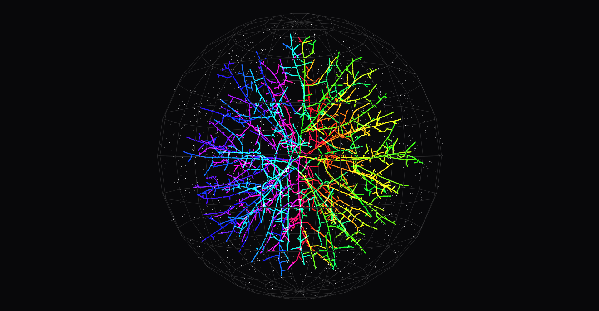
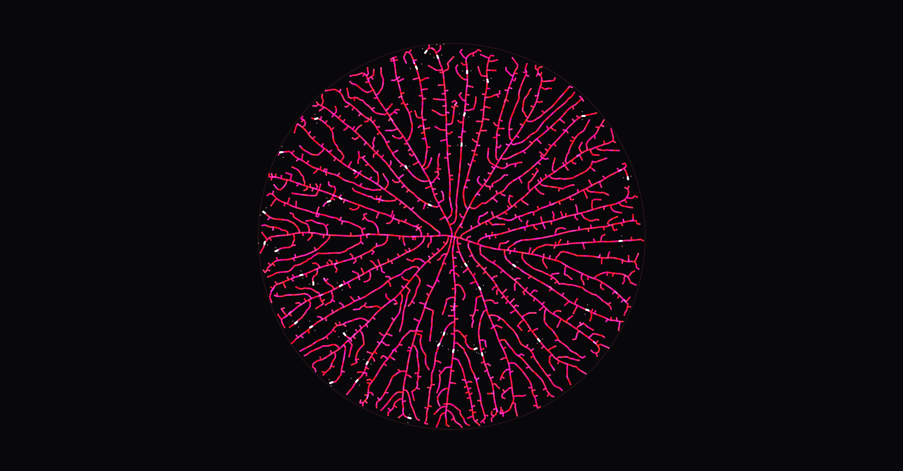
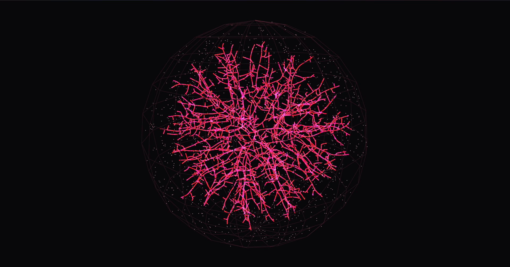
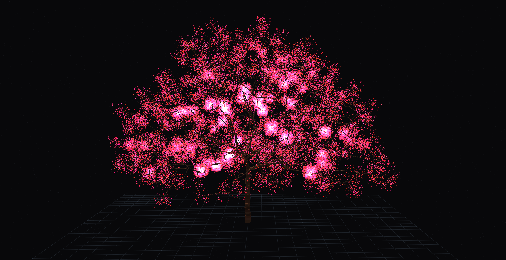

# Space Colonization Algorithm
An implementation of the Space Colonization Algorithm with GPU-accelerated (CUDA) examples for 2D and 3D branching/venation synthesis.

The algorithm distributes attraction points in space and grows a network of nodes toward them. Each point pulls on the nearest branch tip within its influence radius, every tip averages the pulls it receives and grows one fixed step in that direction, and any point falling within the kill radius of a branch is removed. Growth continues until the attraction points are exhausted.

The neighborhood search is the expensive part, so it runs as a CUDA kernel with one thread per attraction point. Four variants are included: `2d.cu` for 2D venation, `3d.cu` for generic 3D branching, `tree.cu` for tree-like growth with a trunk, and `3d_rainbow.cu` for a 3D variant with color-mapped output. Animated growth sequences are in `results/`.

## Result

## References

- https://algorithmicbotany.org/papers/abop/abop.pdf
- https://algorithmicbotany.org/papers/venation.sig2005.html
- https://algorithmicbotany.org/papers/runionsa.th2008.html
- https://algorithmicbotany.org/papers/kochhar.th2010.html
- https://algorithmicbotany.org/
